# FastMCP GitHub Assistant 设置指南

> 基于FastMCP框架的GitHub智能助手配置指南

## 🚀 FastMCP框架介绍

FastMCP是一个简化MCP工具开发的Python框架，通过装饰器方式让MCP工具的创建变得更加简单直观。

### FastMCP vs 传统MCP的对比

| 方面 | 传统MCP | FastMCP |
|------|---------|---------|
| 工具定义 | 手写JSON Schema | 装饰器 + 类型注解 |
| 代码复杂度 | 高（需要手动处理工具注册） | 低（自动化处理） |
| 开发效率 | 较慢 | 快速 |
| 类型安全 | 需要手动维护 | 自动推导 |
| 易维护性 | 中等 | 高 |

## 📋 快速开始

### 1. 环境准备

```bash
# 克隆项目
git clone https://github.com/wink-wink-wink555/mcpFirst.git
cd mcpFirst

# 创建虚拟环境
python -m venv venv
source venv/bin/activate  # Windows: venv\Scripts\activate

# 安装依赖（包含FastMCP）
pip install -r requirements.txt
```

### 2. 环境配置

复制环境变量模板：
```bash
cp config.env.example .env
```

编辑 `.env` 文件：
```env
# GitHub API配置（必需）
GITHUB_TOKEN=your_github_personal_access_token_here

# Deepseek AI配置（可选，用于Web界面）
DEEPSEEK_API_KEY=your_deepseek_api_key_here

# MCP服务器配置
MCP_SERVER_NAME=fastmcp-github-assistant
MCP_SERVER_VERSION=1.0.0
```

### 3. 获取GitHub Token

1. 访问 [GitHub Settings > Developer settings > Personal access tokens](https://github.com/settings/tokens)
2. 点击 "Generate new token (classic)"
3. 勾选权限：
   - `public_repo` - 访问公共仓库
   - `read:user` - 读取用户信息
   - `read:org` - 读取组织信息
4. 复制生成的token到 `.env` 文件

## 🔧 FastMCP工具实现原理

### 1. 创建FastMCP实例

```python
from fastmcp import FastMCP

# 创建FastMCP实例
mcp = FastMCP("GitHub智能助手")
```

### 2. 使用装饰器注册工具

```python
@mcp.tool()
def search_github_repositories(query: str, language: Optional[str] = None, 
                              sort: str = "stars", limit: int = 8) -> str:
    """搜索GitHub仓库工具
    
    用户只需要传入搜索关键词和筛选条件即可搜索GitHub仓库。
    
    Args:
        query: 搜索关键词（英文效果更好）
        language: 可选的编程语言筛选
        sort: 排序方式，默认stars（按星数）
        limit: 返回结果数量，默认8个
    
    Returns:
        格式化的GitHub仓库搜索结果
    """
    # 工具实现逻辑
    pass
```

### 3. 工具定义的关键元素

FastMCP自动从以下元素生成工具元数据：

- **函数名称**: 作为工具名称（如 `search_github_repositories`）
- **参数类型注解**: 自动推导参数类型（如 `str`, `Optional[str]`, `int`）
- **详细的文档字符串**: 包含工具描述、参数说明和返回值说明
- **参数默认值**: 自动识别可选参数（如 `sort: str = "stars"`）

### 4. 当前项目注册的工具

FastMCP GitHub助手提供以下4个工具：

1. **search_github_repositories** - 搜索GitHub仓库
2. **get_repository_details** - 获取仓库详细信息  
3. **search_github_users** - 搜索GitHub用户
4. **get_trending_repositories** - 获取热门趋势仓库

## 🏃 启动方式

### 方式1: 启动MCP服务器（推荐）

```bash
# 启动FastMCP服务器
python main_ai.py mcp
```

输出示例：
```
🚀 启动FastMCP GitHub助手MCP服务器...
✅ 配置验证通过
🔧 已注册MCP工具:
   - search_github_repositories
   - get_repository_details
   - search_github_users
   - get_trending_repositories
⏰ 等待AI连接...
```

### 方式2: 启动Web演示界面

```bash
# 启动Web演示（用于查看工具定义）
python main_ai.py
```

访问: http://localhost:3000

## 🤝 连接Claude Desktop

### 1. 找到Claude Desktop配置文件

- **Windows**: `%APPDATA%\Claude\claude_desktop_config.json`
- **macOS**: `~/Library/Application Support/Claude/claude_desktop_config.json`  
- **Linux**: `~/.config/Claude/claude_desktop_config.json`

### 2. 添加FastMCP服务器配置

```json
{
  "mcpServers": {
    "fastmcp-github-assistant": {
      "command": "python",
      "args": ["C:/path/to/your/project/main_ai.py"],
      "env": {
        "GITHUB_TOKEN": "your_github_token_here"
      }
    }
  }
}
```

### 3. 重启Claude Desktop

配置完成后重启Claude Desktop，即可在对话中使用GitHub搜索功能。

## 💻 连接VS Code Cline

VS Code的Cline扩展也支持MCP协议，可以直接连接FastMCP服务器。

### 1. 安装Cline扩展

在VS Code扩展商店搜索并安装"Cline"扩展。

### 2. 配置MCP服务器

#### 方法一：通过Cline界面配置（推荐）

1. 在VS Code中打开Cline扩展面板
2. 点击右上角的**齿轮图标** ⚙️ 或**三点菜单** ⋮
3. 选择 **"MCP Servers"**
4. 点击 **"Installed"** 标签页
5. 点击 **"Configure MCP Servers"** 按钮
6. 在打开的JSON配置文件中添加以下内容：

```json
{
  "mcpServers": {
    "ai-github-assistant": {
      "command": "Your/Project/Path/venv/Scripts/python.exe",
      "args": ["Your/Project/Path/main_ai.py", "mcp"],
      "env": {
        "GITHUB_TOKEN": "你的GitHub令牌",
        "DEEPSEEK_API_KEY": "你的Deepseek API密钥",
        "PYTHONIOENCODING": "utf-8"
      }
    }
  }
}
```

#### 方法二：直接编辑配置文件

**Windows配置文件位置：**
```
%APPDATA%\Code\User\globalStorage\rooveterinaryinc.roo-cline\settings\cline_mcp_settings.json
```

**配置内容：**
```json
{
  "mcpServers": {
    "ai-github-assistant": {
      "command": "Your/Project/Path/venv/Scripts/python.exe",
      "args": ["Your/Project/Path/main_ai.py", "mcp"],
      "env": {
        "GITHUB_TOKEN": "ghp_your_github_token_here",
        "DEEPSEEK_API_KEY": "sk-your_deepseek_key_here",
        "PYTHONIOENCODING": "utf-8"
      }
    }
  }
}
```

### 3. 重要配置说明

#### 使用虚拟环境Python路径
- ✅ **正确**: `D:/Project/venv/Scripts/python.exe`
- ❌ **错误**: `python` (系统Python可能没有安装FastMCP)

#### 环境变量配置
- `GITHUB_TOKEN`: GitHub个人访问令牌
- `DEEPSEEK_API_KEY`: Deepseek AI API密钥（可选）
- `PYTHONIOENCODING`: 确保UTF-8编码，避免emoji显示问题

#### 启动参数
- `main_ai.py`: 主程序文件
- `mcp`: 启动参数，告诉程序以MCP服务器模式运行

### 4. 启动和验证

1. **保存配置文件** (Ctrl + S)
2. **重启MCP服务器**：
   - 在Cline的"Installed"标签页找到服务器
   - 点击 **"Restart Server"** 按钮
3. **检查连接状态**：
   - 🟢 **绿点** = 连接成功
   - 🟡 **黄点** = 正在连接
   - 🔴 **红点** = 连接失败

### 5. 验证工具可用性

展开服务器设置，在**"Tools & Resources"**部分应该能看到：

✅ `search_github_repositories` - 搜索GitHub仓库  
✅ `get_repository_details` - 获取仓库详情  
✅ `search_github_users` - 搜索GitHub用户  
✅ `get_trending_repositories` - 获取热门趋势

### 6. 使用示例

在Cline对话框中输入自然语言请求：

```
帮我搜索一些Python Web框架项目
```

```
查看microsoft/vscode仓库的详细信息
```

```
找找最近热门的JavaScript项目
```

Cline会自动调用对应的FastMCP工具来执行请求。

### 7. 故障排除

#### 问题1：ModuleNotFoundError: No module named 'fastmcp'
**原因**: 使用了系统Python而不是虚拟环境Python  
**解决**: 修改配置中的`command`为虚拟环境的完整路径

#### 问题2：PermissionError 访问日志目录
**原因**: 日志系统尝试在无权限的目录创建文件  
**解决**: 已在代码中修复，使用项目logs目录

#### 问题3：UnicodeEncodeError emoji编码错误
**原因**: Windows命令行默认GBK编码  
**解决**: 
- 已移除print语句中的emoji字符
- 添加`"PYTHONIOENCODING": "utf-8"`环境变量

#### 问题4：连接失败（红点状态）
**检查项目**:
1. 确认Python路径正确：`python --version`
2. 确认项目路径正确：文件是否存在
3. 确认API密钥有效：GitHub token权限
4. 查看错误日志：展开服务器设置查看详细错误

#### 问题5：手动测试服务器
在项目目录的终端中运行：
```bash
# 激活虚拟环境
venv\Scripts\activate

# 测试服务器启动
python main_ai.py mcp
```

期望看到：
```
[MCP] 启动FastMCP GitHub助手MCP服务器...
[OK] 配置验证通过
[TOOLS] 已注册MCP工具:
   - search_github_repositories
   - get_repository_details
   - search_github_users
   - get_trending_repositories
[READY] 等待AI连接...
```

### 8. 高级配置

#### 自定义超时设置
```json
{
  "mcpServers": {
    "ai-github-assistant": {
      "command": "...",
      "args": ["..."],
      "env": { "..." },
      "timeout": 60
    }
  }
}
```

#### 自动批准工具（谨慎使用）
```json
{
  "mcpServers": {
    "ai-github-assistant": {
      "command": "...",
      "args": ["..."],
      "env": { "..." },
      "autoApprove": ["search_github_repositories"]
    }
  }
}
```

## 🔄 FastMCP工作流程

```mermaid
graph TD
    A[AI发起请求] --> B[MCP协议传输]
    B --> C[FastMCP框架接收]
    C --> D[路由到装饰器函数]
    D --> E[执行GitHub API调用]
    E --> F[返回格式化结果]
    F --> G[通过MCP协议返回AI]
```



### 详细流程说明

1. **AI模型发起工具调用**: Claude等AI模型分析用户需求，选择合适的工具
2. **MCP协议传输**: 工具调用请求通过MCP协议传输到FastMCP服务器
3. **FastMCP框架处理**: 
   - 自动解析工具名称和参数
   - 验证参数类型和必需性
   - 路由到对应的装饰器函数
4. **执行工具逻辑**: 
   - 调用GitHub API
   - 处理异步操作
   - 格式化返回结果
5. **返回结果**: 通过MCP协议将结果返回给AI模型

## 🎯 FastMCP的优势

### 1. 开发效率提升

**传统MCP方式**:
```python
# 需要手写复杂的JSON Schema
tools = [
    {
        "type": "function",
        "function": {
            "name": "search_repositories",
            "description": "Search GitHub repositories...",
            "parameters": {
                "type": "object", 
                "properties": {
                    "query": {
                        "type": "string",
                        "description": "Search keywords..."
                    },
                    "language": {
                        "type": "string", 
                        "description": "Programming language filter..."
                    }
                },
                "required": ["query"]
            }
        }
    }
]
```

**FastMCP方式**:
```python
@mcp.tool()
def search_repositories(query: str, language: Optional[str] = None) -> str:
    """Search GitHub repositories by keywords and language filter"""
    pass
```

### 2. 类型安全

- **自动类型检查**: 基于Python类型注解
- **IDE智能提示**: 完整的代码补全支持
- **运行时验证**: FastMCP自动验证参数类型

### 3. 易于维护

- **代码集中**: 工具定义和实现在同一个函数中
- **文档同步**: 文档字符串直接作为工具描述
- **版本控制**: 更容易跟踪工具的变更历史

## 🐛 故障排除

### 常见问题

#### 1. FastMCP安装失败

```bash
# 更新pip
python -m pip install --upgrade pip

# 安装FastMCP
pip install fastmcp
```

#### 2. 工具未注册

**检查点**:
- 确保函数有 `@mcp.tool()` 装饰器
- 确保函数在 `mcp.run()` 之前定义
- 检查函数是否有语法错误

#### 3. GitHub API认证失败

**解决方案**:
```bash
# 检查token是否正确设置
python -c "import os; print(os.getenv('GITHUB_TOKEN'))"

# 测试token权限
curl -H "Authorization: token YOUR_TOKEN" https://api.github.com/user
```

#### 4. Claude Desktop连接失败

**检查步骤**:
1. 确认配置文件路径正确
2. 验证JSON格式有效性
3. 检查Python路径是否正确
4. 重启Claude Desktop

## 📚 进阶使用

### 自定义工具

可以在 `main_ai.py` 或 `src/server.py` 中添加新的工具：

```python
@mcp.tool()
def my_custom_tool(param1: str, param2: int = 10) -> str:
    """我的自定义工具
    
    Args:
        param1: 参数1说明
        param2: 参数2说明，默认值10
    
    Returns:
        工具执行结果
    """
    # 自定义逻辑
    return f"执行结果: {param1}, {param2}"
```

### 异步工具支持

```python
@mcp.tool()
async def async_tool(query: str) -> str:
    """异步工具示例"""
    # FastMCP自动处理异步函数
    result = await some_async_operation(query)
    return result
```

## 🤝 贡献指南

欢迎提交问题和改进建议！

1. Fork项目
2. 创建功能分支
3. 提交更改
4. 发起Pull Request

## 📄 许可证

本项目采用MIT许可证 - 查看 [LICENSE](LICENSE) 文件了解详情。

---

💡 **提示**: 有问题？查看 [Issues](https://github.com/wink-wink-wink555/mcpFirst/issues) 或创建新的issue！ 
