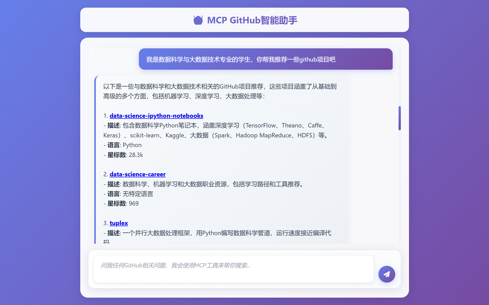
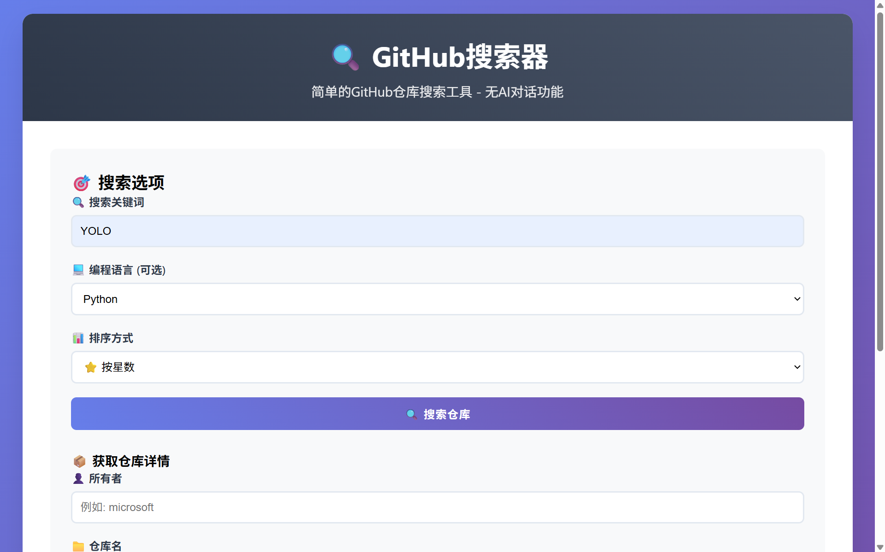
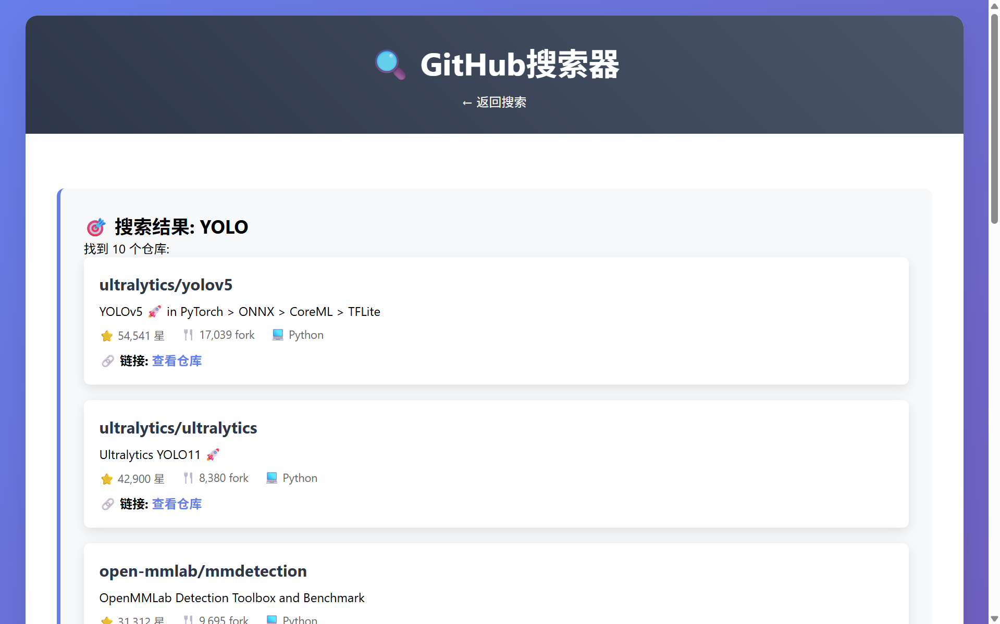

# AI GitHub Assistant

<div align="center">

[](https://opensource.org/licenses/MIT)
[](https://www.python.org/downloads/)
[](https://fastapi.tiangolo.com/)
[](https://github.com/wink-wink-wink555/ai-github-assistant)

一个基于 Deepseek AI 和 MCP 协议的智能 GitHub 助手，支持自然语言查询 GitHub 仓库信息。

[🚀 快速开始](#-快速开始) • [📚 使用指南](#-使用指南) • [🤝 贡献](#-贡献) • [📄 许可证](#-许可证)

</div>

## ✨ 功能特性

- 🤖 **AI 智能对话**: 基于 Deepseek AI 模型，支持自然语言查询
- 🔍 **智能搜索**: 通过关键词搜索 GitHub 仓库，支持多种筛选条件
- 📊 **详细信息**: 获取仓库的完整信息（星数、语言、描述、贡献者等）
- 👥 **用户搜索**: 搜索 GitHub 用户和组织
- 🎯 **精确筛选**: 按编程语言、星数、更新时间等条件筛选
- 🚀 **高性能**: 异步处理，支持并发请求
- 🔒 **安全**: 支持 GitHub Personal Access Token 认证
- 🌐 **Web 界面**: 提供两种界面选择（AI 对话版 + 简单搜索版）

## 🎯 项目亮点

- **双界面模式**: 
  - `ai_github_assistant.py` - 集成 AI 智能对话的完整版本
  - `github_search_web.py` - 简洁的 Web 搜索界面
- **MCP 协议**: 基于 Model Context Protocol 实现标准化工具调用
- **智能问答**: 支持中文自然语言查询，AI 自动理解用户意图
- **现代化 UI**: 响应式设计，支持移动端访问

## 📸 演示截图

### AI 智能助手演示


*AI智能助手 - 查询和RAG有关的Github项目*


*AI智能助手 - 为大数据专业的学生推荐一些Github项目*

### 普通搜索界面演示


*简洁的搜索表单界面 - 搜索和YOLO、Python有关的Github项目，按星数排序*


*搜索结果展示页面 - 展示和YOLO、Python有关的Github项目，按星数排序*

## 🏗️ 项目结构

```
ai-github-assistant/
├── src/                        # 核心源代码
│   ├── __init__.py            # 包初始化
│   ├── config.py              # 配置管理
│   ├── server.py              # MCP 服务器
│   ├── github_client.py       # GitHub API 客户端
│   └── utils/                 # 工具函数
│       ├── __init__.py        
│       └── logger.py          # 日志配置
├── screenshots/               # 演示截图
├── ai_github_assistant.py     # AI 智能助手主程序
├── github_search_web.py       # 简单搜索界面
├── requirements.txt           # 项目依赖
├── config.env.example         # 环境变量模板
├── SETUP_GUIDE.md            # 详细安装指南
├── CONTRIBUTING.md           # 贡献指南
├── LICENSE                   # 开源许可证
└── README.md                 # 项目说明
```

## 🚀 快速开始

### 环境要求

- Python 3.8+
- pip 或 poetry
- GitHub Personal Access Token

### 安装步骤

1. **克隆项目**
   ```bash
   git clone https://github.com/wink-wink-wink555/ai-github-assistant.git
   cd ai-github-assistant
   ```

2. **安装依赖**
   ```bash
   pip install -r requirements.txt
   ```

3. **配置环境变量**
   ```bash
   cp config.env.example .env
   # 编辑 .env 文件，添加你的 GitHub Token 和 Deepseek API Key
   ```

4. **获取 GitHub Token**
   - 访问 [GitHub Settings - Personal Access Tokens](https://github.com/settings/tokens)
   - 创建新的 token，选择 `public_repo` 权限
   - 将 token 添加到 `.env` 文件中

5. **启动应用**
   
   选择其中一种启动方式：
   
   **AI 智能助手版本**（推荐）：
   ```bash
   python ai_github_assistant.py
   ```
   
   **简单搜索版本**：
   ```bash
   python github_search_web.py
   ```

6. **访问应用**
   
   打开浏览器访问 `http://localhost:8000`


## 📚 使用指南

### AI 智能助手模式

支持自然语言查询，例如：
- "推荐一些 Python 机器学习项目"
- "查找 Vue.js 的热门组件库"
- "搜索微软开源的 TypeScript 项目"
- "查看 wink-wink-wink555 的 WordNest 项目详情"

### 简单搜索模式

通过表单进行精确搜索：
- 关键词搜索
- 编程语言筛选
- 排序方式选择
- 用户/组织查询

### API 使用

项目也支持 API 调用：

```python
from src.github_client import GitHubClient

client = GitHubClient()

# 搜索仓库
repos = await client.search_repositories("python web framework")

# 获取仓库信息
repo = await client.get_repository_info("microsoft", "vscode")

# 搜索用户
users = await client.search_users("octocat")
```

## ⚙️ 配置说明

### 环境变量

| 变量名 | 描述 | 默认值 | 必需 |
|--------|------|--------|------|
| `GITHUB_TOKEN` | GitHub Personal Access Token | - | ✅ |
| `DEEPSEEK_API_KEY` | Deepseek AI API Key | - | ✅ |
| `DEEPSEEK_API_URL` | Deepseek AI API 端点 | https://api.deepseek.com/chat/completions | ❌ |
| `GITHUB_BASE_URL` | GitHub API 基础 URL | https://api.github.com | ❌ |
| `LOG_LEVEL` | 日志级别 | INFO | ❌ |

### 高级配置

详细配置选项请参考 [SETUP_GUIDE.md](SETUP_GUIDE.md)

## 🛠️ 开发指南

### 本地开发

1. 克隆项目并安装依赖
2. 创建 `.env` 文件
3. 启动开发服务器：
   ```bash
   python ai_github_assistant.py
   ```

### 代码结构

- `src/` - 核心业务逻辑
- `ai_github_assistant.py` - AI 对话主程序
- `github_search_web.py` - 简单搜索界面
- `requirements.txt` - 依赖管理

### 添加新功能

1. 在 `src/github_client.py` 中添加新的 API 方法
2. 在 MCP 工具定义中注册新工具
3. 更新 AI 助手的处理逻辑

## 📈 技术栈

- **后端**: Python 3.8+, FastAPI, AsyncIO
- **AI 模型**: Deepseek AI API
- **GitHub API**: REST API v4
- **协议**: Model Context Protocol (MCP)
- **前端**: HTML5, CSS3, JavaScript
- **部署**: Uvicorn

## 🤝 贡献

欢迎贡献代码！请遵循以下步骤：

1. Fork 项目
2. 创建特性分支 (`git checkout -b feature/amazing-feature`)
3. 提交更改 (`git commit -m 'Add some amazing feature'`)
4. 推送到分支 (`git push origin feature/amazing-feature`)
5. 创建 Pull Request

### 贡献指南

- 代码风格：遵循 PEP 8 标准
- 测试：添加适当的测试用例
- 文档：更新相关文档
- 提交：使用清晰的提交信息

## 📝 更新日志

### v1.0.0 (2025-7-10)
- 🎉 初始版本发布
- ✅ 基础 AI 对话功能
- ✅ GitHub 搜索集成
- ✅ Web 界面实现
- ✅ 双界面模式支持
- ✅ MCP 协议集成

## 🐛 问题反馈

如果您遇到问题，请通过以下方式反馈：

1. [GitHub Issues](https://github.com/wink-wink-wink555/ai-github-assistant/issues)
2. 查看 [故障排除指南](SETUP_GUIDE.md#故障排除)

## 📄 许可证

本项目采用 MIT 许可证 - 查看 [LICENSE](LICENSE) 文件了解详情。

## 👥 作者

- **wink-wink-wink555** - *Initial work* - [GitHub](https://github.com/wink-wink-wink555)

查看完整的[贡献者列表](https://github.com/wink-wink-wink555/ai-github-assistant/contributors)。

## 🙏 致谢

- [Deepseek AI](https://deepseek.com) - 提供强大的 AI 模型
- [GitHub API](https://docs.github.com/en/rest) - 提供丰富的数据接口
- [FastAPI](https://fastapi.tiangolo.com/) - 现代化的 Web 框架

## 📞 联系我们

- 📧 Email: yfsun.jeff@gmail.com
- 🐛 Issues: [GitHub Issues](https://github.com/wink-wink-wink555/ai-github-assistant/issues)

---

<div align="center">
Made with ❤️ by wink-wink-wink555
</div> 
