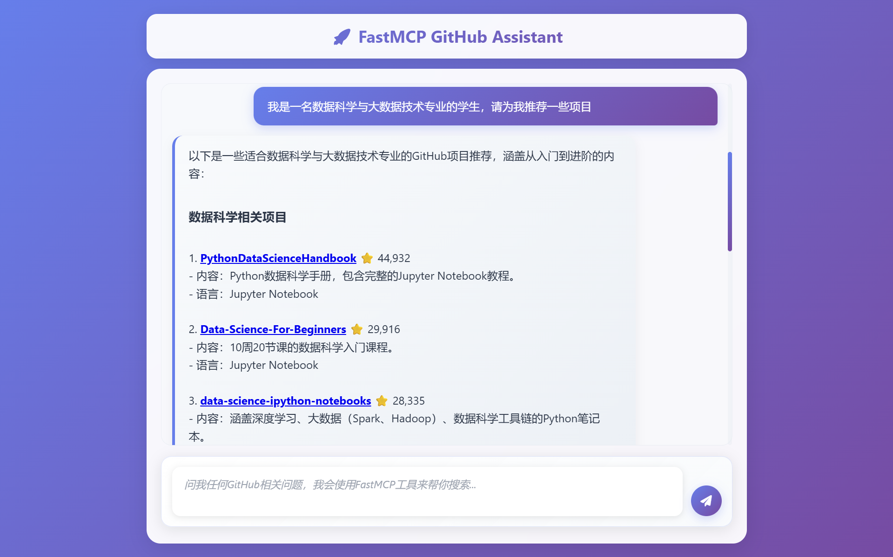

# AI GitHub Assistant - 现代化GitHub智能助手

[](https://github.com/jlowin/fastmcp)
[](https://python.org)
[](LICENSE)
[](https://github.com/wink-wink-wink555/ai-github-assistant)

*🚀 **基于FastMCP框架的现代化GitHub智能助手** - 装饰器驱动的MCP工具开发，体验前所未有的简洁和高效！*

---

**🧭 导航目录**

[🚀 快速开始](#-快速开始) • [📸 演示截图](#-演示截图) • [🛠️ 功能特性](#-功能特性) • [🔑 API密钥获取](#-api密钥获取) • [📚 详细文档](#-详细文档) • [🤝 贡献](#-贡献) • [📄 许可证](#-许可证)

---

## ✨ 为什么选择FastMCP？

FastMCP是新一代MCP工具开发框架，相比传统MCP实现提供：

- **🎯 装饰器驱动**: 一个`@mcp.tool()`装饰器搞定一切
- **🔧 类型安全**: 自动参数验证和类型检查  
- **⚡ 高效开发**: 30分钟完成以前需要3小时的工作
- **🧹 代码简洁**: 大幅缩减代码数量
- **🛡️ 自动化**: 无需手写JSON Schema和路由逻辑

### FastMCP vs 传统MCP

| 特性 | 传统MCP | FastMCP | 提升 |
|------|---------|---------|------|
| 代码行数 | ~150行 | ~30行 | **5x 减少** |
| 开发时间 | 2-3小时 | 30分钟 | **6x 提升** |
| 维护难度 | 高 | 低 | **显著降低** |
| 类型安全 | 手动 | 自动 | **完全自动化** |

## 🛠️ FastMCP工具实现示例

```python
from typing import Optional
from fastmcp import FastMCP
from src.github_client import GitHubClient

# 创建FastMCP实例
mcp = FastMCP("AI GitHub Assistant")

@mcp.tool()
async def search_github_repositories(query: str, language: Optional[str] = None, 
                                   sort: str = "stars", limit: int = 8) -> str:
    """搜索GitHub仓库工具
    
    用户只需要传入搜索关键词和筛选条件即可搜索GitHub仓库。
    
    Args:
        query: 搜索关键词（英文效果更好）
        language: 可选的编程语言筛选
        sort: 排序方式，默认stars（按星数）
        limit: 返回结果数量，默认8个
    
    Returns:
        格式化的GitHub仓库搜索结果
    """
    github_client = GitHubClient()
    repositories = await github_client.search_repositories(
        query=query, language=language, sort=sort, per_page=limit
    )
    # 格式化返回结果
    return str(repositories)

# 启动服务器
if __name__ == "__main__":
    mcp.run()  # 就这么简单！
```

## 📁 项目结构

```
ai-github-assistant/
├── main_ai.py                    # 🤖 AI对话界面（FastMCP + Deepseek AI）
├── main_search.py                # 🔍 Web搜索界面（简洁版）
├── src/
│   ├── server.py                 # 🚀 FastMCP服务器
│   ├── github_client.py          # 📡 GitHub API客户端
│   ├── config.py                 # ⚙️ 配置管理
│   └── utils/
│       └── logger.py             # 📝 日志系统
├── requirements.txt              # 📦 项目依赖
├── config.env.example           # 🔧 配置模板
├── FASTMCP_SETUP.md             # 📖 FastMCP设置指南
└── README.md                     # 📋 项目介绍
```

**就这么简单！** ✨ FastMCP自动处理：
- 🔧 工具注册和元数据生成
- 📝 参数验证和类型检查
- 🔀 请求路由和错误处理
- 📊 结果格式化和返回

## 🚀 快速开始

### 1. 安装依赖

```bash
pip install -r requirements.txt
```

### 2. 配置环境

```bash
# 复制配置文件
cp config.env.example .env

# 编辑配置文件，设置API密钥
# - GITHUB_TOKEN: GitHub个人访问令牌
# - DEEPSEEK_API_KEY: Deepseek AI API密钥
```

### 3. 启动服务

```bash
# 启动Web AI对话界面（默认推荐）
python main_ai.py

# 或启动纯FastMCP服务器模式
python main_ai.py mcp

# 或启动Web搜索界面
python main_search.py
```

## 📸 演示截图

### AI 智能助手演示


*AI智能助手 - 查询和 RAG 有关的 Github 项目*


*AI智能助手 - 为大数据专业的学生推荐一些 Github 项目*

### 普通搜索界面演示


*简洁的搜索表单界面 - 搜索和 YOLO，Python 有关的 Github 项目，按星数排序*


*搜索结果展示页面 - 展示和 YOLO，Python 有关的 Github 项目，按星数排序*

## 🛠️ 功能特性

本项目基于FastMCP实现了4个强大的GitHub工具：

### 1. 🔍 搜索GitHub仓库
```python
from typing import Optional
from fastmcp import FastMCP

mcp = FastMCP("AI GitHub Assistant")

@mcp.tool()
async def search_github_repositories(query: str, language: Optional[str] = None, 
                                   sort: str = "stars", limit: int = 8) -> str:
    """根据关键词搜索GitHub仓库，支持语言筛选和排序"""
    # 实现搜索逻辑
    pass
```

### 2. 📦 获取仓库详情
```python
@mcp.tool()
async def get_repository_details(owner: str, repo: str) -> str:
    """获取指定仓库的完整详细信息"""
    # 实现仓库详情获取逻辑
    pass
```

### 3. 👤 搜索GitHub用户
```python
@mcp.tool()
async def search_github_users(query: str, user_type: Optional[str] = None) -> str:
    """搜索GitHub用户和组织账号"""
    # 实现用户搜索逻辑
    pass
```

### 4. 🔥 获取热门趋势
```python
@mcp.tool()
async def get_trending_repositories(language: Optional[str] = None, 
                                  period: str = "daily") -> str:
    """获取GitHub热门趋势仓库"""
    # 实现趋势仓库获取逻辑
    pass
```

## 💬 使用示例

启动后，您可以通过AI对话进行交互：

> **用户**: "帮我搜索一些Python机器学习相关的热门项目"
> 
> **AI**: *使用 search_github_repositories 工具搜索*
> 
> **用户**: "查看microsoft/vscode仓库的详细信息"
> 
> **AI**: *使用 get_repository_details 工具查询*

## 🏗️ 项目架构

```mermaid
graph LR
    A[用户] --> B[Web界面/AI对话]
    B --> C[FastMCP工具层]
    C --> D[GitHub API客户端]
    C --> E[Deepseek AI]
    
    style B fill:#e1f5fe
    style C fill:#ccffcc
    style D fill:#fff3e0
    style E fill:#f3e5f5
```



### 核心组件

- **🎯 FastMCP工具层**: 使用装饰器定义的GitHub API工具
- **🌐 AI对话界面**: `main_ai.py` - 集成AI的现代化对话界面  
- **🔍 Web搜索界面**: `main_search.py` - 简洁的GitHub搜索界面
- **🚀 FastMCP服务器**: `src/server.py` - 纯FastMCP服务器实现
- **📡 GitHub客户端**: 异步GitHub API调用
- **⚙️ 配置系统**: 统一的环境配置管理

## ⚡ 性能特点

- **🚀 异步处理**: 全面采用异步编程，高性能API调用
- **🔄 并行优化**: 智能并发控制，避免API限流
- **📊 数据完整**: 自动获取完整用户和仓库统计数据
- **🛡️ 安全验证**: 完善的输入验证和错误处理
- **📝 智能日志**: 详细的操作日志和性能监控

## 🔧 技术栈

- **Framework**: FastMCP 0.9.0+
- **Language**: Python 3.8+
- **Web**: FastAPI + Uvicorn
- **AI**: Deepseek API
- **HTTP**: aiohttp异步客户端
- **Logging**: 结构化日志系统

## 📚 详细文档

- 📖 **[FastMCP设置指南](FASTMCP_SETUP.md)** - 完整配置和使用教程
- 🤝 **[贡献指南](CONTRIBUTING.md)** - 参与项目开发

## 🔑 API密钥获取

### GitHub Token
1. 访问 [GitHub Settings > Tokens](https://github.com/settings/tokens)
2. 点击 "Generate new token (classic)"
3. 选择必要权限（public_repo即可）
4. 复制生成的token

### Deepseek API Key
1. 访问 [Deepseek Platform](https://platform.deepseek.com/api_keys)
2. 注册并登录账号
3. 创建新的API密钥
4. 复制API密钥

## 🌟 项目亮点

1. **🎯 现代化架构**: 采用最新FastMCP框架，代表未来MCP开发方向
2. **🤖 AI集成**: 不仅是MCP工具，更是智能GitHub助手
3. **⚡ 高性能**: 异步处理、并行优化、智能缓存
4. **🛠️ 开发友好**: 类型安全、装饰器驱动、易于扩展
5. **📚 学习价值**: 完整的FastMCP开发最佳实践

## 🤝 贡献

欢迎参与项目建设！

- 🐛 **Bug报告**: [创建Issue](https://github.com/wink-wink-wink555/ai-github-assistant/issues)
- 💡 **功能建议**: [讨论想法](https://github.com/wink-wink-wink555/ai-github-assistant/discussions)
- 🔧 **代码贡献**: 查看[贡献指南](CONTRIBUTING.md)

## 📄 许可证

本项目采用 [MIT许可证](LICENSE)

---

⭐ **觉得有用？给个星标支持一下！** 

💬 **有问题？** [创建Issue](https://github.com/wink-wink-wink555/ai-github-assistant/issues) 或查看[文档](FASTMCP_SETUP.md)

🚀 **体验FastMCP的强大，开启现代化MCP工具开发之旅！** 
